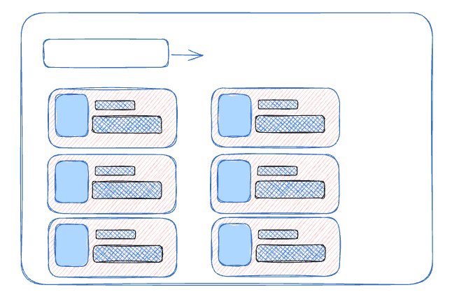

# Online-Library

## [Open Library API](https://openlibrary.org/developers/api)
- Search for books by title or author
- There is also a library [book covers](https://openlibrary.org/dev/docs/api/covers) API

## User Stories

1. Type in a book title into the search bar and hit submit.
2. Receive a page full of book results that are related to the search.
---
1. Choose to search by the author's name in the form.
2. Type in the desired author into the search bar and hit submit.
3. Receive a page full of book results that are related to the search.
---
1. For each book, the user should see the book's title, author, year published, isbn or edition
2. Possible stretch goals could include clicking on a result and being redirected to a page with more information like:
    - viewing similar entries (maybe by subject?)
    - using id_amazon to link to amazon, id_goodreads, id_overdrive
    - An image of the cover
---
1. Selecting an About option on the navigation menu should redirect the user to a page with credits to the API, a link to the github, and information about myself.
---
1. When the user first visits the website, the page should already be populated with books (maybe from the NYT bestsellers or my own favorites?)

## Lofi Wireframe
using https://excalidraw.com/
